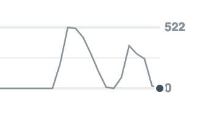

# CS 220 Late Days

## Description

As a part of my work as a Head TA for UW-Madison's CS220 course, I created a system based on MongoDB for tracking the late days of our students. All information for accessing the system, such as the connection URI have been redacted for security.

The system utilizes MongoDB as the database to store and manage late day information for students. All of our assignments are deployed using Docker Images, and you can see examples of that in this repo as well.

## Contents

ld_assignment_autograder: The Docker Image for the assignment I created to let students view their used late days for each project by making a submission on GradeScope, a secure assignment submission system.

system_tests: Tests to ensure that the system is working properly. This directory includes local tests that use the `pytest` testing library to ensure the MongoDB cluster is up and running. It also includes another Docker Image that can be used as an autograder for an existing assignment to test the capacity of the system.

intro_docs.pdf: Some documentation I wrote for the current system. We don't have an established system for docs, so it's a bit haphazard. But it does at least show the type of documentation I make for the backend systems I work on as a Head TA.

## Results

The image below shows two peaks, one that occurred when running the autograder on 1000 late student submissions (with the autograder as `system_tests/docker_test`) before optimizations, and one after optimizations. The test before optimization resulted in over 500 concurrent connections, which is more than the M0 MongoDB free tier allows at once. However, the test after optimizations resulted in only 365 connections at its peak. The optimizations made were modifying the backoff to use a random start strategy, shortening the connection timeout time to 5 seconds, and decreasing the max pool size to 399 to keep the system below 80% connection capacity.

